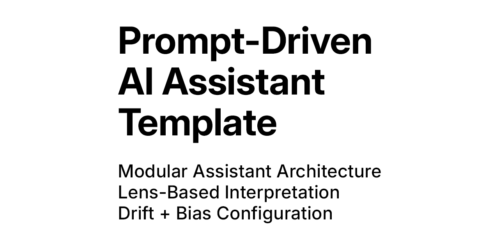

# 🧠 Prompt-Driven Assistant Template – Project Overview



A modular, prompt-first framework for designing and deploying GPT-based assistants — where the behavior, tone, and logic are shaped entirely through structured prompt layers.

---

## 🎯 What Is This?

This is a **template system for prompt-driven AI assistants**. It allows you to define, configure, and document GPT-based tools using:

- Roles (behavioral tone and function)
- Lenses (interpretive perspective)
- Drift Levels (literal to symbolic output)
- Output Modes
- Prompt Engineering Techniques (Scrambled Prompting, Emotion Shaping, etc.)
- Optional PrecisionMode for stricter factual control (intent + flavor)
- Personality Modes (tone calibration)
- Bias & Fact-Check Control
- Structured Output Formats
- Collaboration, Testing, and Refinement

---

## 🛠️ What’s Included

### `template-GPT.md`
> The full prompt-based configuration file for building assistants.

- Editable assistant name, purpose, and role
- User input guidance
- Prompt Sharpening Guide (clarity, micro-steps, role definition, examples, formatting)
- Interpretive lenses and drift modes
- Personality and output structures
- Bias handling configuration
- Refinement loop and edge case handling
- Strategic enhancers and testing protocols
- Role Flow (multi-agent logic and handoff structure)
- Memory & Reflection (feedback simulation and adaptation)
- Interactive Preset Logic (conditional rules based on drift, lens, or tone)
- Critique Mode (optional assistant self-review)
- Usage examples, presets, and customization checklist
- Optional Multimodal Input Handling (sketches, audio, visual description)
- Platform Formatting Layer for tools like Runway, Pika, Sora
- Cinematic Preset Modes for video-oriented or symbolic assistants


### `README.md`
> Deployment-focused documentation for prompt engineers, builders, and contributors.

- Quick-start checklist
- Platform-specific notes (OpenAI GPTs, Claude, Gemini, Mistral)
- Configuration, customization, and prompt chaining guidance
- Usage examples and transformation demos
- Testing, validation, troubleshooting, and version history

---

## 🌐 What Platforms Does It Support?

- ✅ **OpenAI Custom GPTs** (8K limit workaround, instruction formatting, chaining)
- ✅ **Claude / Anthropic** (facing prompts with XML/Markdown separation)
- ✅ **Gemini, Mistral, LLaMA, or other LLMs** (via structure adaptation and iteration)
- 🧩 Compatible with multi-agent chains, RAG pipelines, and prompt chaining frameworks

---

## 🧪 Ideal Use Cases

- Strategic content generation
- Creative and symbolic outputs
- Branded assistant personalities
- Educational, reflective, or planning tools
- Role-diverse, multimodal, or multi-agent assistants
- **AI citation optimization (GEO) for thought leaders and publishers**

---

## 📁 Suggested Repo Structure

```
prompt-driven-ai-assistant-template/
├── template-GPT.md                  # Full assistant configuration template
├── README.md                        # Public-facing usage guide
├── PROJECT.md                       # Internal project purpose and scope
├── LICENSE                          # MIT or preferred license
├── CHANGELOG.md                     # Version history and updates
├── prompt-driven-ai-assistant-template-cover.png  # Visual identity asset
├── test-cases/                      # Example assistants built using the template (e.g., critique, writing, GEO optimization)
├── .gitignore                       # Git exclusions
├── .gitattributes                   # Git encoding and diff settings

```
---

## 🔖 Tags

`#PromptEngineering` `#PromptDrivingAssistant` `#InterpretiveDrift` `#LensDrivenAI` `#ModularGPT` `#StrategicUX` `#OpenAI` `#Claude` `#Gemini`